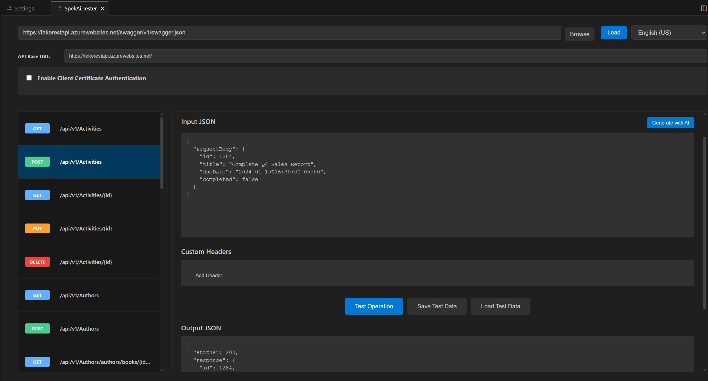
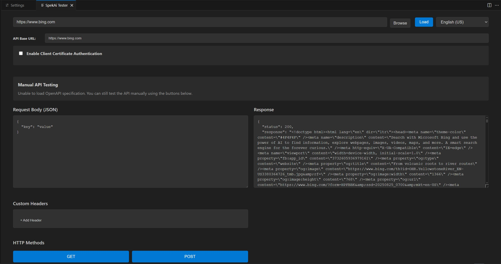

# SpekAi - OpenAPI Testing Extension for VS Code

A VS Code extension that provides a React-based UI for testing OpenAPI specifications.

## Screenshots





## Features

### Core OpenAPI Testing
- **URL Input**: Enter any OpenAPI specification URL for testing
- **Local File Support**: Browse and load OpenAPI specifications from local files with file:// support
- **Multi-format Support**: Supports both JSON and YAML OpenAPI specification formats
- **Dynamic UI Generation**: Automatically generates UI components for each API operation from the spec
- **Smart Parameter Handling**: 
  - Path parameters with automatic URL substitution
  - Query parameters with proper encoding
  - Header parameters with custom header support
- **Request Body Editor**: Full-featured JSON editor for request payloads
- **Test Execution**: Execute API calls directly from the UI with real-time results
- **Response Display**: View API responses with status codes, headers, and formatted JSON

### Advanced Testing Features
- **AI-Powered Test Data Generation**: Generate realistic test data using LLM with locale support
- **Multi-Language Support**: Generate test data appropriate for 20+ locales (English, Spanish, French, German, Japanese, etc.)
- **Custom Headers Management**: Add, edit, and remove custom HTTP headers per operation
- **Schema-Based Examples**: Automatically generate example values from OpenAPI schemas
- **Parameter Validation**: Real-time validation against OpenAPI parameter constraints

### Fallback Testing Mode
- **Manual API Testing**: When OpenAPI spec loading fails, automatically switches to manual testing mode
- **HTTP Method Buttons**: Direct testing with GET, POST, PUT, DELETE operations
- **Flexible JSON Input**: Manual JSON request body editing for any API endpoint
- **Persistent Fallback UI**: Stable interface that doesn't disappear during testing
- **Error Recovery**: Graceful handling of invalid or inaccessible OpenAPI specifications

### Security & Authentication
- **Client Certificate Authentication**: Full mTLS (mutual TLS) support with:
  - Client certificate file configuration (.crt, .pem)
  - Private key file support (.key, .pem)
  - Optional passphrase protection
  - CA certificate chain support
  - Global certificate settings for all operations

### Data Management
- **Save/Load Test Data**: Persistent storage of test configurations including:
  - Input JSON and parameters
  - Custom headers
  - Client certificate settings
  - API base URL configuration
  - Operation metadata
- **Cross-Session Persistence**: Reload test data across VS Code sessions
- **Flexible Data Loading**: Load test data for any compatible operation
- **Fallback Mode Persistence**: Save/load functionality works in both normal and fallback modes

### Developer Experience
- **VS Code Integration**: Seamless integration with VS Code's webview system
- **Real-Time Updates**: Live editing of JSON with syntax validation
- **Error Handling**: Comprehensive error messages and recovery suggestions
- **URL Management**: Editable API base URL with automatic extraction from OpenAPI specs
- **Operation Organization**: Clean list view of all available API operations with filtering

### Technical Capabilities
- **OpenAPI 3.0 Support**: Full compatibility with modern OpenAPI specifications
- **Multiple File Formats**: Native support for JSON and YAML OpenAPI specification files
- **Local File Access**: Direct file system access with cross-platform file path handling
- **Reference Resolution**: Automatic resolution of $ref references in schemas
- **Schema Validation**: Request validation against OpenAPI schemas
- **Multiple Content Types**: Support for various request/response content types
- **Concurrent Operations**: Handle multiple API calls simultaneously
- **Cross-platform Compatibility**: Works on Windows, macOS, and Linux with native file dialogs

## Usage

### Basic OpenAPI Testing
1. Open the command palette (`Ctrl+Shift+P` / `Cmd+Shift+P`)
2. Run the command "Open SpekAi Tester"
3. **Load OpenAPI Specification**:
   - **Remote**: Enter an OpenAPI specification URL (e.g., `https://petstore3.swagger.io/api/v3/openapi.json`)
   - **Local File**: Click "Browse" to select a local OpenAPI file (.json, .yaml, .yml)
4. Click "Load" to fetch and parse the specification
5. Select an operation from the left panel
6. Edit parameters and request body in the JSON editor
7. Click "Test Operation" to execute and view responses

### Advanced Features
- **AI Test Data**: Click "Generate with AI" to create realistic test data for any locale
- **Custom Headers**: Use the headers editor to add authentication tokens or custom headers
- **Client Certificates**: Enable mTLS authentication by configuring client certificate paths using Browse buttons
- **File Browsing**: Use Browse buttons throughout the interface to select files with native OS dialogs
- **Save/Load**: Save test configurations and reload them later for consistent testing
- **Manual Testing**: If OpenAPI spec fails to load, use the fallback mode with HTTP method buttons

### Fallback Mode (Manual Testing)
When OpenAPI specification loading fails, the extension automatically switches to manual testing mode:
1. Enter JSON request data in the editor
2. Configure custom headers if needed
3. Click GET, POST, PUT, or DELETE buttons to test endpoints directly
4. View responses and save/load test configurations

## Development

### Prerequisites

- Node.js (v16 or higher)
- npm

### Setup

```bash
# Install dependencies
npm install
cd ui && npm install && cd ..

# Build the extension
npm run compile
cd ui && npm run build && cd ..
```

### Running

1. **Open this folder in VS Code**
2. **Make sure all dependencies are installed**: Run `npm install` and `cd ui && npm install`
3. **Build the project**: Run `npm run compile` and `cd ui && npm run build`  
4. **Press F5** to run the extension in a new Extension Development Host window
5. **In the new window**, open Command Palette (`Ctrl+Shift+P`) and run **"Open SpekAi Tester"**

### Troubleshooting

If you get "Cannot find module 'vscode'" error:
- This error is normal when testing the extension outside VSCode
- The `vscode` module is only available inside VSCode's extension host environment
- Make sure to run the extension using F5 from within VSCode, not from command line
- Ensure you have built both the extension (`npm run compile`) and UI (`cd ui && npm run build`)

## Project Structure

```
├── src/                 # Extension TypeScript source
│   ├── extension.ts     # Main extension entry point
│   └── SpekAiPanel.ts   # Webview panel management
├── ui/                  # React UI source
│   ├── src/
│   │   ├── App.tsx      # Main React component
│   │   ├── index.tsx    # React entry point
│   │   └── index.css    # Styles
│   ├── dist/            # Built UI files
│   └── package.json     # UI dependencies
├── out/                 # Compiled extension
└── package.json         # Extension manifest
```

## Building for Distribution

```bash
npm run vscode:prepublish
```

This will compile the extension and build the UI for production.